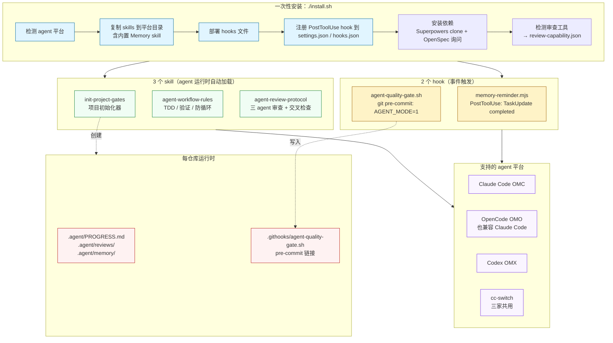
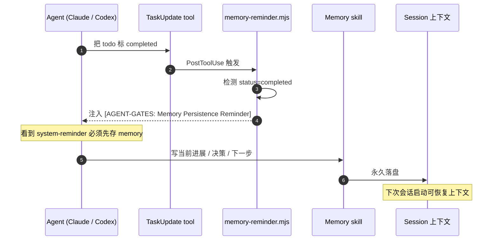
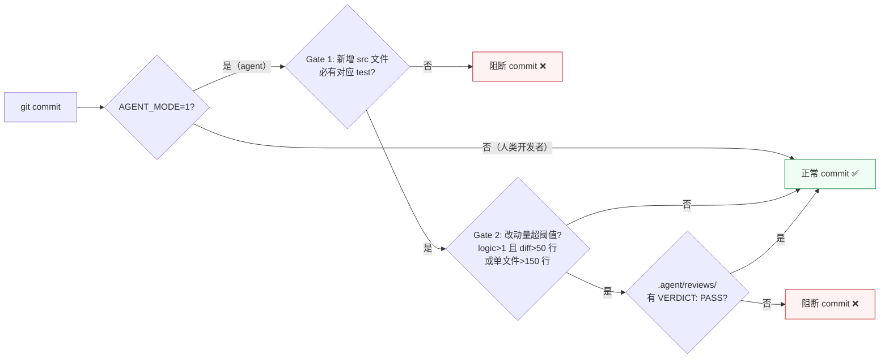
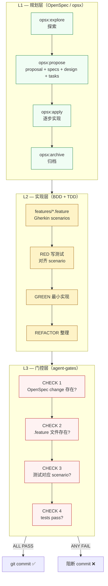
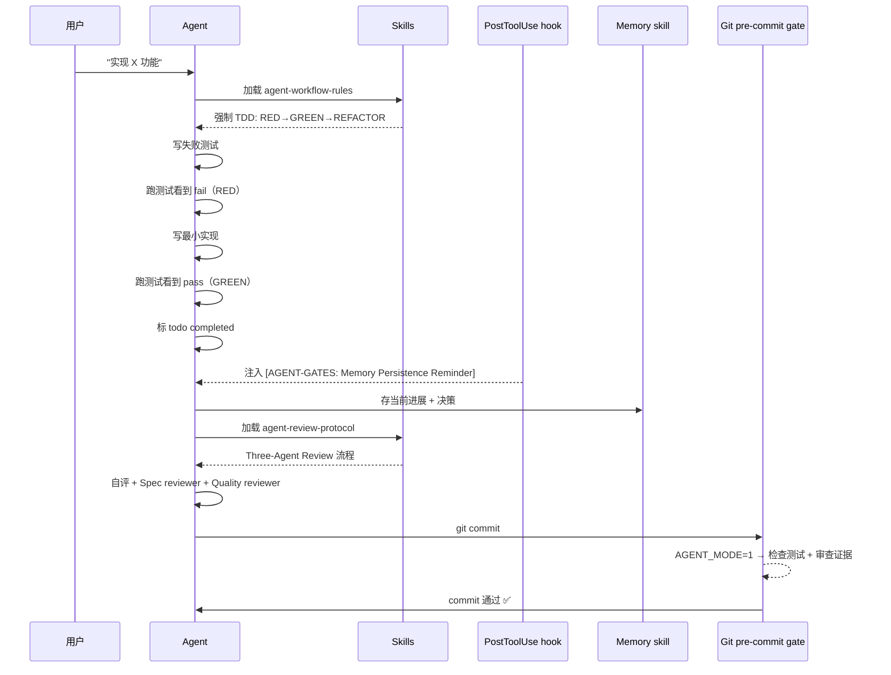

# agent-gates 是什么

> 跨平台 AI agent 的**工程纪律运行时执行层**（runtime gate layer）。一次安装，让 Claude Code / OpenCode / Codex 三个 agent 平台同时获得 TDD 守门、交叉审查证据检查、Memory 持久化提醒、commit 质量门控。

---

## 1. 解决了什么问题

LLM agent 写代码很快，但很容易：

- 跳过 TDD，先写实现再补测试（甚至不补）
- 自评"已完成"——但没真的跑过验证命令
- 修 bug 修不动了开始瞎试，没有 stop-and-rethink 信号
- todo 完成了但 session 一中断上下文全丢，下次接续从零开始
- commit 把无关改动一起带进来，单 PR 几十文件
- 多 agent 平台各自一套规则，跨平台一致性靠人工

**单纯写在 prompt 里的规则没用** —— agent 读完就忘，没有"刹车"。需要的是 **运行时强制点**（hook + 门控），让违规行为出错而不是滑过去。

agent-gates 就是这一层：把工程纪律编码成 **三个 skill + 两个 hook + 一个项目模板**，配套自动安装器（install.sh）、自检工具（doctor.sh）、卸载器（uninstall.sh）。

---

## 2. 整体架构



---

## 3. 三大支柱怎么工作

### 支柱一：runtime skill 注入工程纪律

agent 在打开 IDE / 启动会话时，自动加载下面三个 skill 的 SKILL.md。这些 markdown 文件里写的是 **行为规则**（TDD 必走 RED→GREEN、3 次失败强制 stop、commit 前必跑测试……），agent 通过 system prompt 把它们当硬约束执行。

| Skill | 触发时机 | 强制内容 |
|---|---|---|
| `init-project-gates` | 用户喊"初始化项目" / "init project gates" | 创建 `.agent/` 目录 + 装 pre-commit hook + 生成 AGENTS.md |
| `agent-workflow-rules` | 写代码 / 修 bug / 重构 | TDD 三阶段、计划评审门控、3-strike 防循环、verification-before-completion |
| `agent-review-protocol` | 实现完成、走交叉审查 | Three-Agent Review 流水线、严重性分级、再审防环规则 |

### 支柱二：PostToolUse hook 守 Memory 持久化



**关键点**：hook 是平台原生 PostToolUse 事件（OMC 在 `~/.claude/settings.json` 注册、OMX 在 `~/.codex/hooks.json` 注册、OMO 原生在 `~/.config/opencode/hooks.json` 注册），agent 没法绕过。[oh-my-openagent](https://github.com/Yeachan-Heo/oh-my-claudecode)（OMO）是跨平台编排层，在 Claude Code 上运行时直接读取 `~/.claude/settings.json` 的 PostToolUse hook，因此 OMC 注册同时覆盖了 OMO-on-Claude-Code 场景。validator 拒绝输出 schema 不合规的 hook 响应——v1.2.1 修过这个静默 fail 的 bug。

### 支柱三：git pre-commit gate 守 commit 质量



**核心设计**：这个 gate **只约束 agent**，不影响人类开发者。通过 `AGENT_MODE=1` 环境变量区分。Agent 想 commit 必须先有测试 + 跨 agent 审查证据；人类开发者照常提交。

---

## 4. 依赖什么

| 依赖 | 必需性 | 用途 |
|---|---|---|
| Node.js ≥ 18 | **必需** | 跑 `memory-reminder.mjs`（ES modules + `node:fs`） |
| `git` 或 `curl` | **必需** | install.sh 拉取仓库 |
| `bash` | **必需** | install.sh / doctor.sh / agent-quality-gate.sh |
| `jq` | 推荐 | 安全 merge `hooks.json` / `settings.json`；缺了改走手动 |
| Memory skill | **内置（v1.5.4+）** | agent-gates 仓自带 `skills/memory/`，install 时直接 cp 到 platform skills 目录。fork 自 [clawic/skills](https://github.com/clawic/skills)（MIT），无网络依赖 |
| 至少一个 agent 平台 | 推荐 | OMC / OMO / OMX / cc-switch；install.sh 自动检测。OMO 跨平台兼容 Claude Code / OpenCode / Codex 等，在 Claude Code 上运行时复用 OMC 的 `settings.json` hook 注册 |
| `agent-superpowers` skill 套件 | 推荐（Path B）；`agent-workflow-rules` Skill Gate 硬触发时必需 | 提供 `test-driven-development` / `brainstorming` / `verification-before-completion` / `opsx:explore`；v1.5.2 起 `install.sh` 默认自动 clone 安装 |
| OpenSpec CLI | Path A（团队项目）必需 | 驱动 `opsx:explore` / `opsx:propose` / `opsx:apply` / `opsx:archive`；`doctor.sh check_openspec_install` 报告是否走 Path A |
| `review-capability.json` | 自动生成（v1.6.0+） | `doctor.sh` / `install.sh` 检测异构审查工具（opencode CLI / codex CLI / OMC code-reviewer / Paseo）后持久化到 `~/.agent-gates/review-capability.json`，供 `agent-review-protocol` §8 路由决策 |
| opencode CLI / codex CLI | 可选 | 异构模型交叉审查工具。opencode 支持 GPT-5 / Gemini 等非 Claude 模型，codex 支持 GPT-5 系列。`review-capability.json` 记录可用等级（L0-L3），`agent-review-protocol` §9 按等级选用 prompt 模板 |

> ⚠️ 注意：`$HOME` 路径**不能含空格**——shell hook 无法可靠转义。
>
> ✅ v1.5.2 起，`./install.sh` 默认会**自动安装** Memory skill 与 `agent-superpowers`（14 个 skill），并就 OpenSpec CLI 交互式询问 y/N 后才执行 `npm install -g @openspec/cli`；非交互 shell 默认 N。要保留旧的"全手动"行为，加 `--skip-deps`。
> - Memory skill：**v1.5.4 起内置（bundled）** —— agent-gates 仓自带 `skills/memory/`，install 时直接 cp 到 platform skills 目录；已装则 skip，无网络依赖。fork 自 [clawic/skills](https://github.com/clawic/skills)（MIT），同步备注详见 `skills/memory/UPSTREAM.md`
> - `agent-superpowers`：clone `obra/superpowers` 全量复制，5 个核心硬触发 skill 已装则 skip 整批
> - OpenSpec CLI：检测 `which openspec`，缺失时询问 y/N 后再装（明确告知全局环境影响，红线 #2）
>
> 如果通过 `--skip-deps` 或交互拒绝，agent-gates 仍能跑 —— 默认走 Path B（仅 TDD，无 OpenSpec / BDD），`doctor.sh` 把缺失项报告为 `note`（不适用），不是 `FAIL`。

---

## 5. 与 agent-superpowers / OpenSpec 的关系

> 这个工具不是凭空冒出来的。它是 2026-05-18 那份《**BDD + CLI Gate + OpenSpec 整合方案**》（本地 Vault：`Wiki/04_Knowledge/AI/Agent/编码助手/BDD-CLI-Gate-OpenSpec整合方案.md`）里 L3 加部分 L2 的工程化落地。

整合方案的核心论点是：纯 prompt 约束不够，必须**让代码（而非提示词）成为最终裁判**。方案分三层：



### 5.3 实施度盘点（v1.3.1 现状 — 已过时，见下方 v1.6.0 盘点）

> **以下表格是 v1.3.1 时的快照，保留作历史参考。v1.5.0-v1.6.0 大幅推进了 L1/L2/L3，当前实施度见 §5.3.1。**

<details>
<summary>v1.3.1 历史盘点（点击展开）</summary>

诚实交代：v1.3.1 只完成了设计的约 1/3，且方向有偏移。

| 层 | 设计要求 | agent-gates v1.3.1 实际 | 状态 |
|---|---|---|---|
| L1 OpenSpec — `openspec init` 集成 | `install.sh --with-openspec` 调用 opsx，部署 `.opencode/skills/openspec-*` + `commands/opsx-*` | 完全没集成。`install.sh` grep 不到 `openspec` 任何关键字 | ❌ 0% |
| L1 OpenSpec — 全局规则路径 A | `10-workflow.md` 区分团队项目 / 个人项目两条路径 | 全局 `10-workflow.md` 已写路径 A，但只是 prompt 约束 | ⚠️ 规则层落了，工具层 0 |
| L2 BDD — `features/` 脚手架 | `init-project-gates` 加 `features/` 目录 + 多语言 step_definitions 模板 | `templates/` 下没有 features/；`skills/init-project-gates/templates/` 只有 PROGRESS.md | ❌ 0% |
| L2 BDD — RED 阶段对齐 scenario | `agent-workflow-rules` SKILL.md 明确"RED 必须实现 scenario step definitions" | SKILL.md §2 第 75 行只有一句话提及，没具体模板、没 enforcement | ⚠️ 嘴上一句 |
| L2 TDD — RED→GREEN→REFACTOR | 完整强制约束 + Iron Law + 例外授权机制 | `agent-workflow-rules` §2 完整实现 | ✅ 100% |
| L2 Three-Agent Review | 设计只提 Oracle 审查一句 | `agent-review-protocol` 扩成 Implementer/Spec/Quality 三角色 + 严重性分级 + 防环规则 | ✅ 100%（超出设计） |
| L3 CHECK 1 — OpenSpec change | 项目有 `openspec/` 时检查活跃 change | hook 没这分支 | ❌ 0% |
| L3 CHECK 2 — .feature 存在 | 检测新增功能文件且无对应 `.feature` → FAIL | hook 没这分支 | ❌ 0% |
| L3 CHECK 3 — 测试对应 | 新增 src 必有对应 test 文件 | Gate 1 ✅（多语言 ts/js/py/java/kt/go） | ✅ 100% |
| L3 CHECK 4 — tests pass | 设计明确**不放 hook**，由 CI 负责 | hook 没跑测试（符合设计） | ✅ 设计本意 |
| L3 自加 Gate 2 — Cross-Review 证据 | （设计没提） | `.agent/reviews/*.md` + VERDICT 行 + 4h 新鲜度 + post-review 改动量 | ⚡ 自加 |
| L2 隐形 — Memory persistence | （设计完全没提） | `memory-reminder.mjs` PostToolUse hook + `agent-workflow-rules` §8 | ⚡ 自加（关键） |
| 运维 — AGENT_MODE 设置 | installer 帮 agent 配 | install.sh 完全不配；只在 `init-project-gates` 的 CLAUDE.md 注入文本里**一句话**让 agent 自行 `export AGENT_MODE=1` | ⚠️ 文档级 |
| 运维 — lefthook/husky 集成 | installer 用 lefthook.yml 或 .husky/pre-commit | install.sh 不调用任何 hook manager；`init-project-gates` SKILL.md 描述了 if-else 逻辑但要 agent 当时手动执行 | ⚠️ skill 描述级 |
| 运维 — 部署健康检查 | （设计没提） | `doctor.sh` 11 项检查 + CI-friendly | ⚡ 自加 |
| 运维 — 多平台 hook 注册 | 设计只提 lefthook/husky 一种 | OMC/OMO/OMX/cc-switch 跨 4 平台 PostToolUse hook 注册 | ⚡ 自加 |
| 运维 — uninstall | （设计没提） | `uninstall.sh` + legacy schema sweep | ⚡ 自加 |

实施度按层估算（v1.3.1）：

```
L1 OpenSpec 规划层：  ██░░░░░░░░░░░░░░░░░░  10%
L2 BDD 实现层：       ██░░░░░░░░░░░░░░░░░░  10%
L2 TDD + Review：     ████████████████████  100%（含超出设计的 Three-Agent Review）
L2 Memory（自加）：   ████████████████████  100%
L3 4 个 CHECK：       █████░░░░░░░░░░░░░░░  25%（只做了 CHECK 3）
L3 Cross-Review Gate（自加）：████████████████████  100%
运维基础设施（自加）：██████████████████░░  90%
```

</details>

### 5.3.1 实施度盘点（v1.6.0 现状）

v1.5.0-v1.6.0 连续 7 个版本把 L1/L2/L3 三层从"约 1/3"推到了"约 90%"。

| 层 | 设计要求 | agent-gates v1.6.0 实际 | 状态 |
|---|---|---|---|
| L1 OpenSpec — `openspec init` 集成 | `install.sh --with-openspec` 调用 opsx | `install.sh` 检测 `which openspec`，缺失时交互式询问 y/N 后执行 `npm i -g @openspec/cli`（v1.5.0） | ✅ 90% |
| L1 OpenSpec — 全局规则路径 A | `10-workflow.md` 区分团队 / 个人两条路径 | `agent-workflow-rules` §3 Path A/B routing 完整实现，`init-project-gates` 提示用户先跑 `openspec init`（v1.5.0） | ✅ 100% |
| L2 BDD — `features/` 脚手架 | `init-project-gates` 加 `features/` 目录 + 多语言 step_definitions 模板 | `templates/features/` + TypeScript/Python/Java step_definitions 模板（v1.5.0） | ✅ 100% |
| L2 BDD — RED 阶段对齐 scenario | SKILL.md 明确 RED 必须实现 scenario step definitions | `agent-workflow-rules` §4 TDD RED 阶段 BDD 对齐子节 + §6 Gherkin 完整规范（v1.5.0） | ✅ 100% |
| L2 TDD — RED→GREEN→REFACTOR | 完整强制约束 + Iron Law + 例外授权 | `agent-workflow-rules` §4 完整实现（v1.3.2 起） | ✅ 100% |
| L2 Three-Agent Review | Implementer/Spec/Quality 三角色 | `agent-review-protocol` 三角色 + 严重性分级 + 防环规则 + §8 自适应审查路由 + §9 prompt 模板（v1.6.0 新增跨平台路由） | ✅ 100% |
| L3 CHECK 1 — OpenSpec change | 项目有 `openspec/` 时检查活跃 change | `agent-quality-gate.sh` CHECK 1 分支，trivial 变更跳过，存量项目 WARN（v1.5.0） | ✅ 100% |
| L3 CHECK 2 — .feature 存在 | 新增功能文件且无对应 `.feature` → FAIL | `agent-quality-gate.sh` CHECK 2 分支（v1.5.0） | ✅ 100% |
| L3 CHECK 3 — 测试对应 | 新增 src 必有对应 test 文件 | Gate 1（多语言 ts/js/py/java/kt/go），原有 | ✅ 100% |
| L3 CHECK 4 — tests pass | 设计明确**不放 hook**，由 CI 负责 | hook 不跑测试（符合设计） | ✅ 设计本意 |
| L3 CHECK 5 — Cross-Review 证据 | `.agent/reviews/` + VERDICT + 新鲜度 | Gate 2 + v1.6.0 跨平台审查路由（根据 `review-capability.json` 自适应选择审查工具） | ✅ 100% |
| L2 Memory persistence | PostToolUse hook + 存档 reminder | `memory-reminder.mjs` + `agent-workflow-rules` §13；Memory skill v1.5.4 起内置（bundled），无网络依赖 | ✅ 100% |
| 运维 — `check_superpowers_install` | 检测上游 skill 是否安装 | `doctor.sh` 检测 `test-driven-development` / `brainstorming` / `verification-before-completion` / `opsx:explore`（v1.5.1） | ✅ 100% |
| 运维 — 依赖自动安装 | install.sh 自动装 Memory + Superpowers + OpenSpec | Memory 内置 cp（v1.5.4）+ Superpowers clone（v1.5.2）+ OpenSpec 交互询问（v1.5.2） | ✅ 100% |
| 运维 — 三平台 hook 注册 | OMC / OMO / OMX | 三平台 PostToolUse hook 注册 + `doctor.sh` 全量检测 | ✅ 100% |
| 运维 — 跨平台审查路由 | 检测异构审查工具 + 持久化 + 路由 | `review-capability.json` 持久化、L0-L3 等级检测、`agent-review-protocol` §8 路由 §9 模板（v1.6.0） | ✅ 100% |
| 运维 — doctor / uninstall | 自检 + 卸载 | `doctor.sh` 全量检查 + `uninstall.sh` + legacy sweep | ✅ 100% |

实施度按层估算（v1.6.0）：

```
L1 OpenSpec 规划层：  ██████████████████░░  90%（install 集成 + Path A/B routing + init 判断）
L2 BDD 实现层：       ██████████████████░░  90%（§6 Gherkin + features 脚手架 + step_definitions）
L2 TDD + Review：     ████████████████████  100%（§4 TDD + Three-Agent + 跨平台审查路由）
L2 Memory：           ████████████████████  100%（内置 skill + PostToolUse hook）
L3 5 个 CHECK：       ██████████████████░░  90%（CHECK 1-3,5 全部实现；CHECK 4 by CI 符合设计）
运维基础设施：        ███████████████████░  95%（三平台注册 + doctor + 依赖自动安装 + 审查路由）
```

### 5.4 A. 设计明确不做、agent-gates 强行加了的 — 方向审查

#### A1. Gate 2 Cross-Review 证据检查

**设计说**：CHECK 4 "tests pass" 不放 hook，因为执行测试太慢，应由 CI 或手动 test 负责。
**agent-gates 做了**：Gate 2 检查 `.agent/reviews/<date>-<topic>.md` 存在 + 含 `VERDICT: PASS` 行 + 4 小时新鲜度 + post-review 改动 < 20 行。

**方向审查**：

| 维度 | 评估 |
|---|---|
| 跟设计是否冲突 | 不冲突。Cross-Review 不是 "tests pass" 替代品，它检查的是**另一件事**（审查证据是否存在），不是测试是否通过 |
| 是否合理 | ✅ 合理。Agent 自评通过容易漏架构 / 安全问题，cross-review（用不同模型）能补这层。在无 CI 的个人项目尤其有价值 |
| 是否应进设计文档 | ✅ 应该。建议加到 L3 作为 **CHECK 5**（与 CHECK 4 并列，CHECK 4 给 CI，CHECK 5 给 agent commit gate） |
| 风险 | review 文件造假（agent 自己写一份 VERDICT: PASS 应付 hook）。当前 4 小时新鲜度 + post-review 改动量做了一定缓解，但仍可绕过 |

**结论**：方向对，但**文档应明确这是 L3 自加的 CHECK 5，不是 CHECK 4 替代**。我之前把它写成"替代 CHECK 4"是错的。

#### A2. CLAUDE.md 注入（强制 export AGENT_MODE=1 + 不许 --no-verify）

**设计说**：AGENT_MODE 由全局 agent rule 规定，installer 不管。
**agent-gates 做了**：`init-project-gates` 把这条规则注入到项目 CLAUDE.md，绑定到具体项目。

**方向审查**：✅ 比设计更稳妥。设计依赖全局规则（不同 agent 可能没装），项目级 CLAUDE.md 注入是兜底。**建议保留，无需调整设计**。

### 5.5 B. 设计完全没提、agent-gates 自己加的 — 可能是设计缺失

#### B1. Memory persistence hook（`memory-reminder.mjs`）

**设计说**：0 字。
**agent-gates 做了**：PostToolUse hook，agent 每次标 todo completed 时注入 system-reminder 提醒存 memory，配合 `agent-workflow-rules` §8。

**是否应反向写回设计**：

| 维度 | 评估 |
|---|---|
| 真实问题 | ✅ 是。Agent session 上下文窗口有限，工作中断丢上下文是高频问题（v1.2.1 端到端验证过） |
| 解决得对 | ✅ 是。Hook 在 tool 完成后注入 reminder，agent 必须当下处理；比单纯 prompt 约束有效 |
| 跟 L1/L2/L3 框架的关系 | 它不是 commit 时的 gate（L3），也不是 spec 规划（L1）。属于 **L2 实现层** 的横切关注点 |
| 设计文档应该补 | ✅ 强烈建议。原方案文档 `BDD-CLI-Gate-OpenSpec整合方案.md` 加 **§第四层 — Memory 持久化** 或在 L2 内加一节 "Session 持久化约束"，引用 `memory-reminder.mjs` 实现 |

**建议**：本会话结束前在 Vault 中给原方案加一个 patch 段（"补遗：Memory 持久化"），把 hook 设计反向写回。

#### B2. Three-Agent Review pipeline（`agent-review-protocol`）

**设计说**：只在 "全局规则变更摘要" 提到 "审查阶段包含 BDD 审查"，没展开。
**agent-gates 做了**：Implementer 自评 → Spec Reviewer（独立验证需求）→ Quality Reviewer（6 维度）+ 严重性分级（Critical/Important/Suggestion）+ 防环规则（2 轮 cap）。

**是否反向写回设计**：

| 维度 | 评估 |
|---|---|
| 真实问题 | ✅ 是。单 Oracle 审查容易自评不充分；分角色降低盲点 |
| 解决得对 | ✅ 是。三角色 + 严重性 + 防环这套已经在多轮 release 中验证过有效 |
| 跟 L1/L2/L3 关系 | 属于 **L2 实现层** 的子流程（实现完成后的审查环节） |
| 设计文档应该补 | ✅ 建议。原方案在 "全局规则变更摘要" 第 5 条加细节，或单独加 §"L2.5 实现后审查管道" |

#### B3. doctor.sh / uninstall.sh / 跨平台 hook 注册

**设计说**：0 字。聚焦理论层，不涉及部署运维。
**agent-gates 做了**：v1.3.x doctor 自检 + uninstall + 4 平台 hook 注册。

**是否反向写回设计**：

| 维度 | 评估 |
|---|---|
| 真实问题 | ✅ 是。原方案文档只写"装个 hook"，但实际部署涉及版本管理、多平台、升级路径、回滚。这些是落地必需 |
| 跟 L1/L2/L3 关系 | **横切** L1/L2/L3，属于 "实施层" 而不是 "方案层" |
| 设计文档应该补 | ✅ 建议在原方案末尾加 **附录 A "运维基础设施"**，说明：(1) installer 多平台兼容；(2) doctor 自检；(3) uninstall + legacy sweep；(4) 版本管理 |

### 5.6 C. 没实现的部分 — 可落地实施计划

按依赖关系排序，分 3 个 release：

> **基准变化（2026-05-22 起）**：`agent-workflow-rules` SKILL.md 成为**工作流规则的权威源**，全局 `~/.claude/rules/global/10-workflow.md` 退化为同步镜像。新增 / 修改规则**必须先改 skill**，再同步全局。这是为了让 agent 在没有全局规则时也能基于 skill 独立工作，并消除"两份不一致"的风险。

#### v1.3.2（本次 release，已完成）— skill 升级为规则基准

| 任务 | 范围 | 状态 |
|---|---|---|
| C0. 把 10-workflow.md 内容落进 SKILL.md | `agent-workflow-rules` 16 节版本：新增 §1 意图识别、§3 Path A/B 路由、§5 OpenSpec Workflow、§6 BDD Gherkin、§8 CLI Pre-commit Gate；TDD §4 加 RED 阶段 BDD 对齐子节；anti-pattern §15 加 Path A / OpenSpec 检查 | ✅ 完成 |

#### v1.4.0 — 文档与软约束补齐（无破坏性）✅ 已交付（2026-05-22）

| 任务 | 范围 | 状态 |
|---|---|---|
| C1. `doctor.sh` 加 `check_openspec_install`（团队项目）+ `check_bdd_features_dir`（检测 features/） | doctor.sh 新增两个 check 函数 + main 调度 + `tests/run_doctor.sh` 5 个新用例 | ✅ 已交付；`bash tests/run_doctor.sh` 9/9 通过 |
| C2. README + docs/platform-hooks.md 加 OpenSpec / BDD 章节，说明项目级用法 | README 新增 "Workflow Paths: A vs B" 章节；`docs/platform-hooks.md` 加 "Project-level checks (v1.4)" 附录 | ✅ 已交付 |
| C3. **反向更新 Vault `BDD-CLI-Gate-OpenSpec整合方案.md`**：加 §"L2.4 Memory 持久化" + §"L2.5 实现后审查管道" + 附录 A 运维基础设施 | 修原设计文档（通过 obsidian-cli 写回） | ⏳ 待处理（agent-gates 仓库外 Vault 文档，作为 follow-up 单独跟进，不阻塞 v1.4.0 ship） |
| C4. 全局 `10-workflow.md` 同步 skill 内容（精简为 skill 概要 + 引用 skill 路径） | `~/.claude/rules/global/10-workflow.md` 改为 ~85 行入口，指向 `agent-workflow-rules` SKILL.md 为权威源，冲突时 skill 赢 | ✅ 已交付 |

**v1.4.0 已交付实施度**：L1 10% / L2 70% / L3 25% / 运维 95% — 规则层 + 文档层补齐（v1.4.1 起继续推 L3 hard gate）

**已知限制**（同步至 [CHANGELOG.md](../CHANGELOG.md) v1.4.0 Known limitations）：
- `doctor.sh` 暂不检测上游 `agent-superpowers` skill（`test-driven-development` / `brainstorming` / `verification-before-completion` / `opsx:explore`）。Skill Gate 把它们当硬触发，但安装与否目前由用户负责。`check_superpowers_install` 与 `check_openspec_install` 同形态，规划进 v1.5。
- `install.sh` 不自动安装上游 skill 与 OpenSpec CLI（红线：禁止未经确认执行破坏性命令）；缺失时只打印候选路径，不替用户改系统。

#### v1.4.1 — L3 CHECK 1 落地（OpenSpec hard gate）✅ 已完成（实际合入 v1.5.0）

| 任务 | 范围 | 状态 |
|---|---|---|
| C5. `agent-quality-gate.sh` 加 **CHECK 1**：项目有 `openspec/changes/` 时检查活跃 change 存在；trivial 变更跳过；存量项目默认 WARN | hook 加分支 | ✅ v1.5.0 |
| C6. `install.sh --with-openspec` 标志：检测 `openspec` CLI 存在 → 交互式询问 y/N 后安装 | install.sh 加 `--with-openspec` 解析 + 子函数 | ✅ v1.5.0 |
| C7. `init-project-gates` SKILL.md 增加"如果项目准备走 OpenSpec → 提示用户先跑 `openspec init`"的判断 | skill 加分支 | ✅ v1.5.0 |

#### v1.4.2 — L3 CHECK 2 + BDD 脚手架（BDD hard gate）✅ 已完成（实际合入 v1.5.0）

| 任务 | 范围 | 状态 |
|---|---|---|
| C8. `agent-quality-gate.sh` 加 **CHECK 2**：检测 staged 文件含新增非 test 文件且 `features/` 不存在或为空 → FAIL / WARN | hook 加分支 | ✅ v1.5.0 |
| C9. `init-project-gates` 加 `features/` 目录脚手架 + 多语言 step_definitions 模板（TypeScript / Python / Java） | `templates/features/` + step definitions | ✅ v1.5.0 |
| C10. `doctor.sh` 加 `check_bdd_step_definitions`（有 features/ 但无 step_definitions/ → WARN） | doctor 加 check | ✅ v1.5.0 |
| C11. `agent-workflow-rules` SKILL.md 加示例 commit message 标注 "scenario: X" 引用 | 文档补 | ✅ v1.5.0 |

#### v1.5+ — 原标"不在本季度"，实际已全部完成

| 原备忘条目 | 落地版本 | 说明 |
|---|---|---|
| `check_superpowers_install` | v1.5.1 | 检测 4 个硬触发 skill 是否安装 |
| 依赖自动安装（Memory + Superpowers + OpenSpec） | v1.5.2 | install.sh 默认自动安装，`--skip-deps` 保留手动模式 |
| Memory skill 内置 | v1.5.4 | fork clawic/skills MIT，删除 sparse-clone 网络依赖 |
| 跨平台审查路由 | v1.6.0 | `review-capability.json` + L0-L3 等级 + §8 路由 §9 模板 |

仍在备忘、未落地的方向：

- CI 集成：`.github/workflows/agent-gates.yml` 模板中加 BDD 测试运行（CHECK 4 in CI）
- OMO skill 双源解析适配调研：OMO 在 Claude Code 上优先读 `~/.config/opencode/skills/`，其次 `~/.claude/skills/`；`install.sh` 当前只写一个目录，考虑双写或 symlink
- Trace logger 集成（已有 v1.2.x 实验，未产品化）
- Multi-agent worktree orchestration 集成（与 Paseo / Codex 协同）

### 5.7 v1.5.0-v1.6.0 变更摘要

| 版本 | 日期 | 主题 | 关键变更 |
|---|---|---|---|
| **v1.5.0** | 2026-05-25 | OpenSpec + BDD 全面集成 | CHECK 1（OpenSpec change 检查）/ CHECK 2（.feature 检测）/ `features/` 脚手架 + 多语言 step_definitions 模板 / `agent-workflow-rules` §6 BDD Gherkin 完整规范 / §3 Path A vs B routing |
| **v1.5.1** | 2026-05-25 | Superpowers 检测 + 扩展规则 | `check_superpowers_install`（4 个硬触发 skill）/ codegraph-chpwd hook / §17 迭代收敛规则 / §18 团队模式 |
| **v1.5.2** | 2026-05-26 | 依赖自动安装 | install.sh 默认自动安装 Memory（sparse-clone）+ Superpowers（clone obra/superpowers）+ OpenSpec（交互询问）/ `init-deep-fallback` skill 兜底 / 平台检测一致性修复 |
| **v1.5.3** | 2026-05-27 | doctor banner 修复 | doctor.sh banner 动态读取 `.version` 文件（之前硬编码 "v1.5"） |
| **v1.5.4** | 2026-05-28 | Memory skill 内置 | fork clawic/skills（MIT）到 `skills/memory/`，install 时 cp 到 platform skills 目录；删除 sparse-clone 网络依赖 |
| **v1.5.5** | 2026-05-28 | 健壮性修复 | trivial skip 时输出 info 日志 / `doctor.sh` 函数统一 `return 0` 兜底（E2E 测试发现的边界情况） |
| **v1.6.0** | 2026-05-29 | 跨平台审查路由 | doctor/install 检测异构审查工具（opencode CLI / codex CLI / OMC code-reviewer / Paseo）/ `review-capability.json` 持久化 / `agent-review-protocol` §8 自适应路由 + §9 prompt 模板 / CI、Windows、WSL、容器环境支持 |

---

### 5.8 跟 agent-superpowers 怎么比

agent-superpowers 是 **L2 纪律规则的另一种交付形态**——它把规则做成一个 SKILL.md + 一段 AGENTS.md snippet，靠 agent 自觉遵守。agent-gates 与它**并列存在**：

| 维度 | agent-superpowers | agent-gates |
|---|---|---|
| 形态 | 单一 skill + AGENTS.md 注入 | 跨平台 installer + 多 skill + hook + 模板 |
| 强制层 | 仅 L2（提示词约束） | L2（skill 约束）+ L3（git pre-commit 硬阻断） |
| 多 agent 平台 | 任意支持 SKILL.md 的 agent | OMC / OMO / OMX / cc-switch 都装，hook 统一注册 |
| Memory 持久化 | 不管 | PostToolUse hook 主动注入 reminder |
| 与 OpenSpec 协同 | 不挂钩 | 当前未集成；v1.4.1 起补齐 |
| 自检工具 | 无 | `doctor.sh` |

**一句话总结**：
- **OpenSpec** = L1 规划层（说要做什么、为什么、怎么验收）
- **agent-superpowers** = L2 的纯 prompt 版本（轻量、靠 agent 自觉）
- **agent-gates** = L2（skill + memory hook）+ L3（CLI gate 硬阻断）+ 运维（doctor/uninstall/多平台/审查路由）的工程化落地。v1.6.0 与原整合方案的实施度已达约 90%（详见 §5.3.1）

---

## 6. 如何使用

### 6.1 一行装好

```bash
curl -fsSL https://raw.githubusercontent.com/mcdowell8023/agent-gates/main/install.sh | bash
```

或克隆后装：

```bash
git clone https://github.com/mcdowell8023/agent-gates.git
cd agent-gates && ./install.sh
```

安装器会：
1. 检测 agent 平台（OMC / OMO / OMX / cc-switch），找不到就装到默认 `~/.claude/skills/`
2. 复制 3 个 skill 到对应平台的 skills 目录
3. 部署 hook 文件到 `~/.agent-gates/hooks/`
4. 注册 PostToolUse hook 到平台 settings.json / hooks.json（OMO 当前打印手动指引）
5. 部署 doctor.sh 自检工具到 `~/.agent-gates/doctor.sh`

### 6.2 装完体检

```bash
~/.agent-gates/doctor.sh
```

输出示例（理想 Path A：装了 OpenSpec、≥1 个 `.feature`、transcript 无 hook 错误）：

```
✓ node v26.0.0
✓ jq jq-1.8.1
✓ Memory skill detected: ~/.cc-switch/skills/memory-1.0.2
✓ installed version: 1.6.0
✓ up to date with remote (1.6.0)
✓ memory-reminder.mjs present
✓ agent-quality-gate.sh present (executable)
✓ OMC settings.json hook registered (matcher contains TaskUpdate)
✓ OMO hooks.json hook registered
✓ OMX hooks.json hook registered
✓ hook output schema valid (hookEventName=PostToolUse, reminder included)
✓ no memory-reminder hook errors in last-7d transcripts
✓ OpenSpec installed in current project (Path A applies)
✓ BDD features/ has 3 .feature file(s)

13 pass · 0 warn · 0 fail
```

默认 Path B 项目（无 OpenSpec、无 `features/`）下，最后两项变 `note`（不适用 / 未配置）而不是 PASS，所以典型输出是 **11 PASS + 2 note**，不是 13 PASS。`note` 表示"不适用"，不是"坏了"。

退出码：**0 = 无 FAIL（允许 WARN）；1 = 有 FAIL**——CI 友好。
标志：`--quiet`（只显示汇总）/ `--no-network`（离线模式）/ `--help`。

### 6.3 在项目里启用

任意一个 git 仓库内，告诉 agent：

```
初始化项目
```

agent 会调用 `init-project-gates` skill，自动：

1. 创建 `.agent/` 目录（含 PROGRESS.md / GATES.md / reviews/ / plans/ / memory/）
2. 装 pre-commit hook 到 `.githooks/agent-quality-gate.sh`
3. 生成 AGENTS.md 层级（调 deepinit）
4. 注入工作流规则到项目 CLAUDE.md

之后 agent 在这个仓库里写代码会自动遵守 TDD、verification、cross-review 等约束；commit 会被 pre-commit gate 检查。

### 6.4 端到端流程



---

## 7. 关键文件 / 目录

```
~/.agent-gates/                          # 全局安装位置
├── .version                             # 1.6.0
├── doctor.sh                            # 体检工具
├── review-capability.json               # 异构审查工具检测结果（v1.6.0+）
└── hooks/
    ├── platform/memory-reminder.mjs     # PostToolUse hook
    └── git/agent-quality-gate.sh        # 项目 pre-commit 母版

~/.claude/skills/                        # OMC skills（或对应平台路径）
├── init-project-gates/SKILL.md
├── agent-workflow-rules/SKILL.md
├── agent-review-protocol/SKILL.md
└── memory/SKILL.md                      # 内置 Memory skill（v1.5.4+）

~/.claude/settings.json                  # 注册 hook：
                                         # .hooks.PostToolUse[].command
                                         # 指向 ~/.agent-gates/hooks/platform/memory-reminder.mjs

<project>/.agent/                        # 仓库内（init-project-gates 创建）
├── PROGRESS.md                          # Sprint 进度（git 跟踪）
├── GATES.md                             # 质量门 checklist
├── reviews/                             # 交叉审查证据（git 跟踪）
├── plans/                               # 实现计划（git 跟踪）
└── memory/                              # 会话 memory（.gitignored）

<project>/.githooks/agent-quality-gate.sh  # pre-commit hook copy
```

---

## 8. Troubleshooting 速查

| 症状 | 多半是 | 怎么修 |
|---|---|---|
| `node not found` | Node.js 不在 PATH | 装 Node ≥ 18 |
| Hook 触发了但 Memory 没存 | 没装 Memory skill | 在任意 skills 目录装一个 memory 类 skill |
| 升级了 agent-gates 但仓库行为没变 | per-project hook 不会自动升级 | 在该仓库 `init project gates` 重跑 |
| OMC matcher 不含 TaskUpdate | install.sh 没装到位 | `~/.agent-gates/doctor.sh` 会标 FAIL；重跑 `install.sh --force` |
| hooks.json 出现重复条目 | 手动改过 + 多次跑 installer | `./uninstall.sh && ./install.sh` |

更完整列表见 [README.md → Troubleshooting](../README.md#troubleshooting)。

---

## 9. 资源

- GitHub: <https://github.com/mcdowell8023/agent-gates>
- 当前版本：v1.6.0（2026-05-29）
- 许可：MIT
- 平台 hook 协议详解：[docs/platform-hooks.md](./platform-hooks.md)
- 体检工具：`~/.agent-gates/doctor.sh --help`

> 这份说明同步落在本地 Obsidian Vault：`Wiki/04_Knowledge/AI/Agent/agent-gates.md`。
